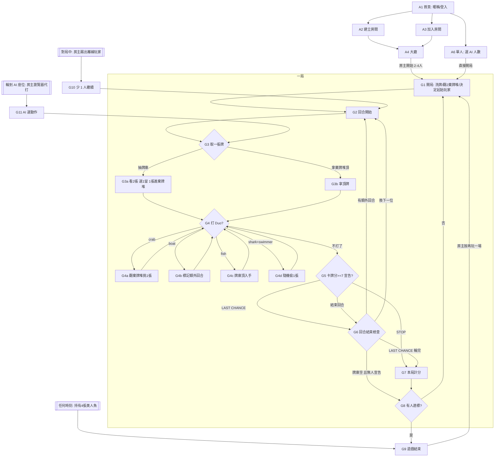

# 01 · Flow 與節點

開發照節點推進：一個節點 = 一組可驗收的行為。節點完成的定義是「驗收條件全部有對應測試且通過」，不是「程式寫了」。

## 驗收怎麼算

- 每條驗收條件有編號（如 `G3-2`），測試名稱必須以 `[G3-2]` 開頭。
- `npm run flow:status` 跑全部測試，依編號回填 `docs/flow-status.md`：
  - ✅ 該節點所有條件都有測試且全過
  - 🟡 部分條件有測試且通過，其餘還沒有測試
  - ❌ 有任何一條測試失敗
  - ⬜ 一條都沒有測試
- 規則類（G 節點）用 Vitest 單元測試驗引擎；畫面類（A 節點、UI）用 Playwright E2E 驗。

## 全局流程

## 節點與驗收條件

### A · 房間

| 節點 | 驗收條件 |
|---|---|
| A1 首頁 | A1-1 首次進站自動匿名登入，輸入暱稱（1–12 字）才能進入；A1-2 暱稱存在本機，重整後免重填 |
| A2 建立房間 | A2-1 建立後取得 4 碼房號，建立者成為房主並進入大廳；A2-2 房號不與進行中房間重複 |
| A3 加入房間 | A3-1 輸入有效房號進入大廳；A3-2 房間不存在、已滿 4 人、已開始，各自顯示對應錯誤訊息 |
| A4 大廳 | A4-1 玩家列表即時同步（第二個瀏覽器加入，第一個不重整就看到）；A4-2 只有房主能按開始，且人數 2–4 才可按；A4-3 玩家按「離開」後列表移除，房主離開則房主轉移給下一位（關閉分頁不算離開，回來可重連） |
| A6 AI 玩家 | A6-1 首頁按「單人遊戲」選 1–3 個 AI，直接進入對局，不經過大廳；A6-2 大廳中房主可加入、移除 AI，AI 與真人合計 2–4 人才可開始；A6-3 AI 座位在大廳與對局中標示「AI」，不顯示離線、不能被踢；A6-4 房間至少要有 1 位真人，最後一位真人離開時房間關閉 |
| A5 重連 | A5-1 遊戲中重整頁面，回到同一房間同一座位，手牌不變；A5-2 對局不設超時，離線玩家標示離線，房主可把離線玩家踢出；A5-3 房主踢出後，其他人的畫面變成少 1 人的對局（規則見 G10、規則 §8），被踢者的畫面顯示已被踢出 |

### G · 遊戲引擎（規則見 [00-rules.md](00-rules.md)）

| 節點 | 驗收條件 |
|---|---|
| G0 牌組 | G0-1 共 58 張，各種類張數符合規則 §1；G0-2 各色總數符合規則 §1；G0-3 每張 id 唯一 |
| G1 開局 | G1-1 牌庫 56 張、兩棄牌堆各 1 張、所有人手牌 0；G1-2 第一局起始玩家由 seed 決定且可重現；G1-3 之後各局起始玩家 = 上局宣告者下一位，無人宣告則為上局起始玩家下一位 |
| G2 回合開始 | G2-1 只有當前玩家能送出動作，其他人送出被拒；G2-2 每回合必須先取牌才能打 Duo 或宣告；G2-3 牌庫與兩棄牌堆皆空時跳過取牌 |
| G3a 抽牌庫 | G3a-1 拿牌庫頂 2 張，留 1 張入手、1 張放到指定棄牌堆頂；G3a-2 有空棄牌堆時只能放空的那堆；G3a-3 牌庫剩 1 張時直接入手；G3a-4 牌庫 0 張時不可選 |
| G3b 拿棄牌堆 | G3b-1 拿指定棄牌堆頂牌入手；G3b-2 空棄牌堆不可選 |
| G4 Duo 共通 | G4-1 只接受合法組合（crab/crab、boat/boat、fish/fish、shark/swimmer）；G4-2 打出的牌從手牌移到自己場上；G4-3 一回合可打多對；G4-4 效果無法執行時仍可打出 |
| G4a crab | G4a-1 指定非空棄牌堆，挑任意 1 張入手，其餘順序不變；G4a-2 被挑的是哪張不出現在其他玩家看得到的動作紀錄；G4a-3 打出 crab 對時只指定棄牌堆，進入挑牌階段後才挑牌（`PICK_CRAB`）；挑牌階段只接受 `PICK_CRAB` |
| G4b boat | G4b-1 本回合結束後同一玩家再一回合；G4b-2 一回合打多對 boat 只多 1 回合；G4b-3 宣告 STOP/LAST CHANCE 時額外回合作廢 |
| G4c fish | G4c-1 牌庫頂 1 張入手；G4c-2 牌庫空時無效果 |
| G4d shark+swimmer | G4d-1 指定一位手牌非空的對手，隨機偷 1 張（同 seed 可重現）；G4d-2 LAST CHANCE 宣告者不可被指定 |
| G5 宣告 | G5-1 卡牌分 < 7 不可宣告；G5-2 STOP 直接進計分；G5-3 LAST CHANCE 後其他玩家各一回合，再進計分 |
| G6 回合結束 | G6-1 牌庫空且無人宣告 → 本局作廢 0 分；G6-2 LAST CHANCE 中帆船額外回合照常；G6-3 輪替順序正確 |
| G7 計分 | G7-1 duo/collector/multiplier/mermaid 卡牌分符合規則 §5（含手上未打出的對子）；G7-2 STOP 每人得卡牌分；G7-3 LAST CHANCE 宣告者贏（含平手）；G7-4 LAST CHANCE 宣告者輸；G7-5 顏色加分含 white |
| G8 局間 | G8-1 總分累加；G8-2 未達標時開新局，所有牌回收重洗 |
| G9 遊戲結束 | G9-1 達目標分（2/3/4 人 = 40/35/30）結束，最高分勝；G9-2 平手依規則 §7；G9-3 任何時刻持有 4 張美人魚立即獲勝 |
| G10 踢出玩家 | G10-1 踢出後玩家數 −1、目標分改用新人數；G10-2 被踢者的牌移出遊戲，58 張守恆（含移出區），之後各局不再洗回；G10-3 輪到被踢者時由下一位開始新回合，帆船額外回合作廢；G10-4 被踢者是 LAST CHANCE 宣告者時宣告取消；G10-5 只剩 1 人時遊戲結束、該玩家獲勝 |
| G11 AI 決策 | G11-1 `chooseAiAction(state, playerId)` 在 AI 要行動的每個階段都回傳合法動作：4 個 AI 用 200 個 seed 各打完一整場，沒有不合法動作、都能結束；G11-2 同一個 state 回傳同一個動作；G11-3 只讀該座位看得到的資訊：改動對手手牌與牌庫順序，回傳的動作不變；G11-4 能湊成對子、美人魚或已收集種類的棄牌堆頂牌優先拿，否則抽牌庫；抽牌庫時留價值高的那張；G11-5 手上能打的 Duo 都會打；shark+swimmer 偷手牌最多的對手；crab 選張數多的棄牌堆（選堆時只看得到頂牌與張數），翻開後挑價值最高的牌；G11-6 卡牌分 ≥ 7 時宣告 STOP；G11-7 對 200 個 seed，AI 對上隨機合法動作的對手，勝率 ≥ 70% |

### S · 同步與品質

| 節點 | 驗收條件 |
|---|---|
| S1 動作同步 | S1-1 每個動作在 Firestore transaction 內套用引擎並寫回；S1-2 兩個 client 同時送動作，只有一個成功，另一個收到明確錯誤且畫面回到最新狀態 |
| S2 安全規則 | S2-1 非房間成員無法寫入房間；S2-2 未登入無法讀寫；S2-3 成員每次寫入 version 只能 +1，非房主不能改房主、踢人或移除別人，踢人時目標的 presence 須已超過 45 秒（伺服器時間），presence 只能寫入伺服器時間 |
| S3 對局畫面 | S3-1 自己的手牌、場上牌、兩棄牌堆頂、牌庫數、各玩家手牌張數與場上牌可見；S3-2 他人手牌只顯示張數；S3-3 當前可做的動作才可點，其餘停用並有原因提示；S3-4 本局計分時所有人攤牌，由房主按「開始下一局」；S3-5 遊戲結束後由房主按「再玩一場」，其他人等待 |
| S4 部署 | S4-1 push 到 main 自動部署 GitHub Pages（線上頁面的 commit 等於 main 最新 commit）；S4-2 兩個獨立瀏覽器 context 在線上網址完成一整局；S4-3 一個瀏覽器在線上網址開「單人遊戲」配 1 個 AI，打完一整場 |
| S5 美術主題 | S5-1 預設主題「紙藝海岸」：頁面背景是該主題桌布，卡背是該主題卡背；S5-2 切換到「深海夜航」後桌布、卡背、面板配色都換成該主題，重新整理後仍保留選擇；S5-3 每張卡牌面顯示該生物的線稿，卡牌顏色在兩個主題都看得出來 |
| S6 AI 代打 | S6-1 輪到 AI 時由房主的瀏覽器算出動作，間隔約 1 秒送出，走同一個 transaction；S6-2 送出時帶上讀到的 version，version 已變就放棄這一步、重新讀狀態；S6-3 房主離開、轉移，或離線超過 45 秒時，下一位在線真人成為房主，由新房主的瀏覽器接手代打；S6-4 局間計分與遊戲結束時 AI 不動作，仍由房主按「開始下一局」「再玩一場」；S6-5 安全規則：只有房主能在大廳加入或移除 AI 座位（uid 只能是 `ai-1`～`ai-3`，座位名單與 uid 名單一致），真人不能用 AI uid 加入 |
| S7 公開流程圖 | S7-1 部署後 `/sea-salt-paper/flow/` 顯示與本機 Flow Board 相同的節點分欄、驗收條件與測試狀態；S7-2 線上版唯讀，不顯示領取按鈕、領取紀錄與 commit 清單；S7-3 頁面標示建置時的 commit，等於 main 最新 commit；S7-4 遊戲本身的路由（`#/room/...`）不受影響 |
| S8 動作動畫 | S8-1 任何玩家（含 AI）的動作，所有人的畫面都播對應動畫，起點與終點是實際的牌區位置；S8-2 抽牌庫：2 張牌背從牌庫飛到該玩家座位，其中 1 張翻成正面飛到所選棄牌堆（自己是抽牌者時 2 張在飛行途中翻正面，留牌時被丟的那張已是正面）；S8-3 拿棄牌堆：頂牌從左或右棄牌堆飛到該玩家座位；S8-4 打 Duo：2 張牌從該玩家手牌翻正面落到他的場上（打牌者自己的手牌本來就是正面，不翻），接著播效果：fish 牌庫頂 1 張牌背飛到該玩家，shark+swimmer 1 張牌背從被偷者飛到偷牌者，crab 該棄牌堆攤開後 1 張牌背飛到該玩家（不翻正面，對手看不出挑了哪張）；S8-5 宣告 STOP／LAST CHANCE 時所有人畫面跳出宣告者與宣告種類；S8-6 動畫播放時以動作前的畫面為起點，播完才顯示新狀態；連續多個動作依序播完，不跳過、不重複；S8-7 重整、重連，或一次收到多個新動作（斷線補收）時不重播，直接顯示新狀態；S8-8 設定可關閉動畫，關閉時直接顯示新狀態 |
